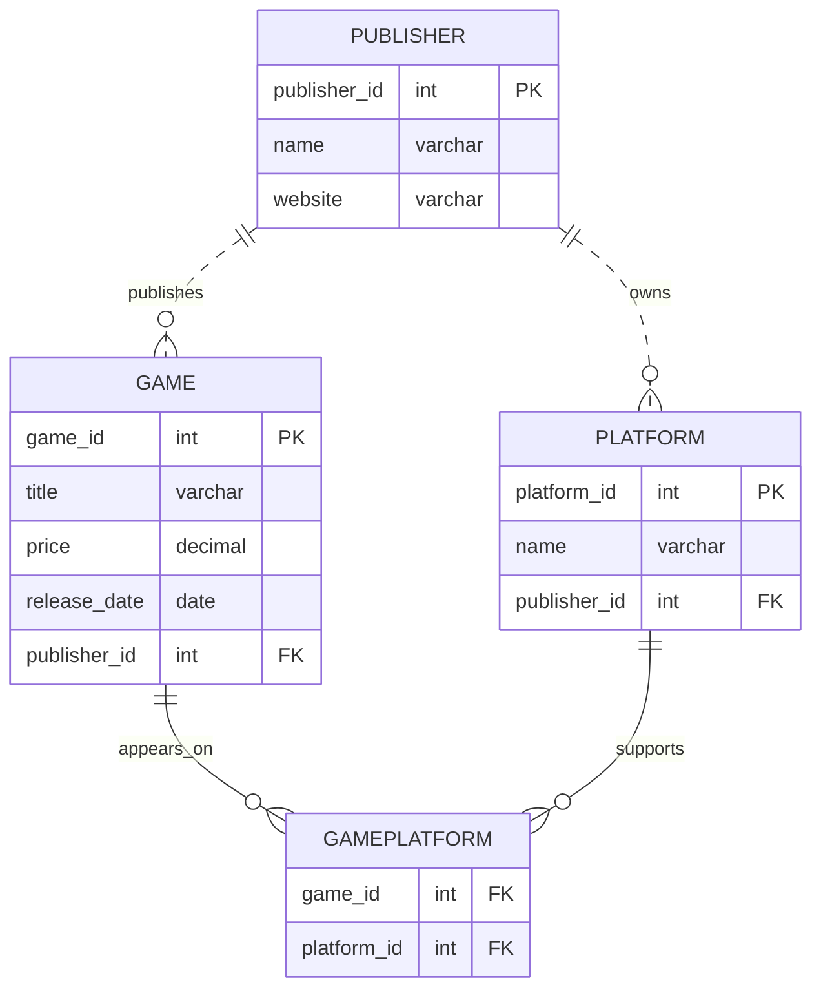

# CS415 Database Final Project – Fall 2025

Robert Heisey

---

## Database Summary Report

### Project Overview
My database is a simplistic Video Game Collecting database. It's meant to store the info of someone's collection of games. A real world example of this kind of system is "PriceCharting" at https://www.pricecharting.com/. Here individuals can look up video games and related devices, and make a list of their own software.

Personally, I really enjoy looking through these websites as game collecting is a hobby of mine. I like the history and cultural impact that these games make. Sometimes you'll see a console with almost nothing released for it or a game that nobody bought at its release that now markets for hundreds of dollars.

### Users View
Since my database is more simple then actual collection databases, there aren't as many usages for it like the real things. Mine just creates a list of games and game platforms for the user to insert into it. There's no looking up a full catalog of a platform or seeing anything not added by the user themself.

The user adds games with its title, price, release date, the platform its on, and its publisher. This way they can see their own personal collection, how many games they have, the prices of those games, and etc. Using the database can create a simpliar way of keeping track of the collection.

---

## Database ER Model



### Database Design Description
The overall design of the database uses four tables. These are Game, Platform, Publisher, and a fourth table that serves as a associate table for linking Game and Platform. The games added to the database can only have one publisher and need at least one platform. The game platforms also can only have one publisher and need at least one game. Meanwhile, the publishers need one game, but they don't need to have a platform as they could have just made games.

| Table                     | Purpose                                                  |
| ------------------------- | -------------------------------------------------------- |
| **Game**                  | The games in the database. Providing the games' title, price, and release date                            |
| **Platform**              | Hardware systems; each belongs to exactly one publisher. Contains the platforms' name |
| **Publisher**             | The publishers of both games and platforms. They might not have made a platform at all. Holds the publishers' name and website.                   |
| **GamePlatform (Assoc.)** | Many-to-many join table linking games to platforms. Since games can be on multiple platforms and platforms can have multiple games.     |

---

### Create Tables 

The following SQL creates the `Game`, `Platform`, `Publisher` and `GamePlatform` tables in the current database. 

```sql

-- CREATE TABLES

CREATE TABLE publisher (
    publisher_id INT PRIMARY KEY AUTO_INCREMENT,
    name VARCHAR(100) NOT NULL,
    website VARCHAR(255)
) ENGINE=InnoDB;

CREATE TABLE platform (
    platform_id INT PRIMARY KEY AUTO_INCREMENT,
    name VARCHAR(100) NOT NULL,
    publisher_id INT NOT NULL,
    FOREIGN KEY (publisher_id) REFERENCES publisher(publisher_id)
) ENGINE=InnoDB;

CREATE INDEX idx_platform_publisher ON platform(publisher_id);

CREATE TABLE game (
    game_id INT PRIMARY KEY AUTO_INCREMENT,
    title VARCHAR(150) NOT NULL,
    price DECIMAL(6,2) NOT NULL,
    release_date DATE NOT NULL,
    publisher_id INT NOT NULL,
    FOREIGN KEY (publisher_id) REFERENCES publisher(publisher_id)
) ENGINE=InnoDB;

CREATE INDEX idx_game_publisher ON game(publisher_id);

CREATE TABLE gameplatform (
    game_id INT NOT NULL,
    platform_id INT NOT NULL,
    PRIMARY KEY (game_id, platform_id),
    FOREIGN KEY (game_id) REFERENCES game(game_id),
    FOREIGN KEY (platform_id) REFERENCES platform(platform_id)
) ENGINE=InnoDB;


```

---

### Insert Data

The following SQL inserts sample data for the `Publisher` (x20), `Platform` (x20), `Game` (x100), and the `GamePlatform` tables in the current database.

```sql
-- INSERT DATA


-- PUBLISHERS (20 rows)


INSERT INTO publisher (publisher_id, name, website) VALUES
(1, 'Starforge Interactive', 'https://starforge.com'),
(2, 'Blue Lantern Studios', 'https://bluelantern.net'),
(3, 'Crimson Peak Gaming', 'https://crimsonpeak.gg'),
(4, 'Ironvale Entertainment', 'https://ironvale.com'),
(5, 'NovaHawk Digital', 'https://novahawk.io'),
(6, 'Silver Ridge Media', 'https://silverridge.org'),
(7, 'Thunderstrike Works', 'https://thunderstrike.games'),
(8, 'Windspire Publishing', 'https://windspire.net'),
(9, 'Nightjar Collective', 'https://nightjar.dev'),
(10, 'Golden Ember Studios', 'https://goldenember.com'),
(11, 'Violet Arc Games', 'https://violetarc.gg'),
(12, 'Obsidian Gate Software', 'https://obsidiangate.io'),
(13, 'Skytrail Entertainment', 'https://skytrail.net'),
(14, 'Rustwood Gaming', 'https://rustwoodgames.com'),
(15, 'HyperPulse Interactive', 'https://hyperpulse.com'),
(16, 'Deepwave Digital', 'https://deepwave.gg'),
(17, 'Astral Nest Studios', 'https://astralnest.net'),
(18, 'Midnight Serpent Works', 'https://midnightserpent.io'),
(19, 'Red Timber Media', 'https://redtimber.org'),
(20, 'Northern Fox Games', 'https://northernfox.gg');


-- PLATFORMS (20 rows)
-- Each platform tied to one publisher


INSERT INTO platform (platform_id, name, publisher_id) VALUES
(1, 'SolarCube One', 1),
(2, 'SolarCube Two', 1),
(3, 'BlueConsole S', 2),
(4, 'BlueConsole X', 2),
(5, 'CrimsonStation 4', 3),
(6, 'CrimsonStation 5', 3),
(7, 'IronCore Portable', 4),
(8, 'IronCore Home', 4),
(9, 'NovaHandheld', 5),
(10, 'NovaHome', 5),
(11, 'SilverBox Mini', 6),
(12, 'SilverBox Pro', 6),
(13, 'ThunderGo', 7),
(14, 'ThunderMax', 7),
(15, 'WindCart', 8),
(16, 'EmberConsole', 10),
(17, 'VioletSphere', 11),
(18, 'Skytrail Air', 13),
(19, 'HyperPulse Rig', 15),
(20, 'AstralDock', 17);


-- GAMES (100 rows)
-- Publisher IDs distributed across the 20 publishers


INSERT INTO game (game_id, title, price, release_date, publisher_id) VALUES
(1, 'Mystic Shores', 39.99, '2019-03-12', 1),
(2, 'Galactic Beacon', 59.99, '2021-07-22', 1),
(3, 'Lantern Vale', 49.99, '2018-11-10', 2),
(4, 'Snowbound Aria', 29.99, '2020-01-14', 2),
(5, 'Peakfall Legends', 69.99, '2023-10-05', 3),
(6, 'Crimson Horizon', 64.99, '2022-04-09', 3),
(7, 'Ironborn Tactics', 44.99, '2016-06-17', 4),
(8, 'Forge of Titans', 59.99, '2021-09-28', 4),
(9, 'NovaSprint', 34.99, '2017-10-11', 5),
(10, 'Hawkeye Protocol', 69.99, '2024-02-05', 5),
(11, 'Ridge Valley', 24.99, '2015-05-19', 6),
(12, 'Silverstorm', 49.99, '2022-06-25', 6),
(13, 'Thunder Drifters', 59.99, '2019-09-30', 7),
(14, 'Stormrage Arena', 69.99, '2023-12-12', 7),
(15, 'Windspire Odyssey', 39.99, '2018-02-21', 8),
(16, 'Windspire Champions', 59.99, '2022-08-09', 8),
(17, 'Nightfall Haunting', 29.99, '2020-10-17', 9),
(18, 'Shadows of the Nightjar', 49.99, '2023-03-14', 9),
(19, 'Emberforge', 69.99, '2021-11-02', 10),
(20, 'Golden Ember Reborn', 59.99, '2024-07-19', 10),
(21, 'Arc of Violets', 44.99, '2019-04-06', 11),
(22, 'Spectrum Bloom', 59.99, '2022-09-01', 11),
(23, 'Gate of Obsidian', 39.99, '2020-03-12', 12),
(24, 'Obsidian Keep', 69.99, '2024-06-10', 12),
(25, 'Skytrail Soaring', 49.99, '2018-07-23', 13),
(26, 'Skytrail Frontier', 69.99, '2023-03-07', 13),
(27, 'Rustwood Trails', 34.99, '2016-04-09', 14),
(28, 'Rustwood Reborn', 59.99, '2022-11-11', 14),
(29, 'HyperPulse Vector', 69.99, '2024-10-15', 15),
(30, 'Pulse Runner', 49.99, '2019-08-28', 15),
(31, 'Deepwave Odyssey', 39.99, '2020-12-01', 16),
(32, 'Deepwave Vector', 59.99, '2022-02-02', 16),
(33, 'Astral Echoes', 69.99, '2024-03-18', 17),
(34, 'Dockbound Frontier', 59.99, '2019-09-22', 17),
(35, 'Serpentfall', 49.99, '2017-05-14', 18),
(36, 'Midnight Venom', 69.99, '2024-01-25', 18),
(37, 'Red Timber Arena', 49.99, '2018-01-03', 19),
(38, 'Timberfall Elite', 69.99, '2023-02-11', 19),
(39, 'Frozen Fox', 44.99, '2016-12-12', 20),
(40, 'Northern Frostline', 59.99, '2024-04-04', 20),

-- 60 more unique games
(41, 'Solarbound', 39.99, '2017-01-07', 1),
(42, 'Starforge Siege', 69.99, '2022-05-01', 1),
(43, 'Lantern Drift', 29.99, '2019-11-14', 2),
(44, 'Blue Lantern Trials', 49.99, '2023-08-08', 2),
(45, 'Crimson Reaches', 39.99, '2021-09-12', 3),
(46, 'Peakstrike Assault', 59.99, '2024-04-02', 3),
(47, 'Ironborne Legacy', 39.99, '2015-02-19', 4),
(48, 'Forge Raiders', 59.99, '2024-04-11', 4),
(49, 'NovaGauntlet', 34.99, '2018-10-20', 5),
(50, 'Hawkeye Signal', 69.99, '2023-12-07', 5),
(51, 'Silver Ridge Quest', 49.99, '2019-04-08', 6),
(52, 'Silverstorm Echo', 59.99, '2021-01-15', 6),
(53, 'Thunderstrike Rally', 69.99, '2022-11-19', 7),
(54, 'Thunderstorm Proving Grounds', 59.99, '2024-08-28', 7),
(55, 'Windspire Legends', 49.99, '2019-02-18', 8),
(56, 'Windspire Exodus', 69.99, '2024-05-25', 8),
(57, 'Nightjar Requiem', 39.99, '2018-09-26', 9),
(58, 'Nightwind Chronicles', 59.99, '2023-07-13', 9),
(59, 'Emberforge Horizon', 69.99, '2021-06-09', 10),
(60, 'Golden Ember Saga', 59.99, '2022-12-30', 10),
(61, 'Arcfall', 34.99, '2016-03-21', 11),
(62, 'Arcshatter', 49.99, '2022-02-14', 11),
(63, 'Obsidian Path', 69.99, '2017-07-02', 12),
(64, 'Obsidian Dominion', 59.99, '2024-09-18', 12),
(65, 'Skytrail Nova', 49.99, '2022-04-04', 13),
(66, 'Skytrail Vanguard', 69.99, '2024-10-10', 13),
(67, 'Rustwood Kingdom', 39.99, '2015-11-30', 14),
(68, 'Rustwood Crusade', 69.99, '2023-03-19', 14),
(69, 'Pulsefire Legacy', 59.99, '2018-06-05', 15),
(70, 'HyperPulse Drift', 69.99, '2024-02-22', 15),
(71, 'Deepwave Shroud', 49.99, '2020-09-09', 16),
(72, 'Deepwave Rift', 69.99, '2024-06-09', 16),
(73, 'Astral Revenant', 39.99, '2017-10-17', 17),
(74, 'Astral Vanguard', 59.99, '2023-02-14', 17),
(75, 'Serpentblade', 49.99, '2016-05-11', 18),
(76, 'Midnight Coil', 69.99, '2024-08-08', 18),
(77, 'Red Timber Legacy', 59.99, '2019-05-05', 19),
(78, 'Timberstrike', 69.99, '2022-02-27', 19),
(79, 'Foxtrail', 34.99, '2018-03-18', 20),
(80, 'Northern Skywatch', 69.99, '2024-09-09', 20),
(81, 'Solarverse', 59.99, '2024-05-04', 1),
(82, 'Beaconfront', 39.99, '2016-11-21', 2),
(83, 'Peakshadow', 49.99, '2021-06-29', 3),
(84, 'Ironvale Trials', 59.99, '2022-11-03', 4),
(85, 'Novafall Drift', 69.99, '2024-01-19', 5),
(86, 'Ridgeborn', 44.99, '2015-10-01', 6),
(87, 'Thunder Circuit', 69.99, '2023-04-14', 7),
(88, 'Windspire Arc', 49.99, '2017-06-06', 8),
(89, 'Nightjar Exodus', 59.99, '2024-02-11', 9),
(90, 'Golden Ember Origins', 69.99, '2022-07-16', 10),
(91, 'Arcverse', 59.99, '2023-10-31', 11),
(92, 'Obsidian Rift', 49.99, '2020-05-24', 12),
(93, 'Skytrail Thunder', 39.99, '2017-07-27', 13),
(94, 'Rustwood Inferno', 59.99, '2024-03-30', 14),
(95, 'Pulsefire Nova', 49.99, '2019-09-09', 15),
(96, 'Deepwave Echo', 69.99, '2023-12-12', 16),
(97, 'Astral Dominion', 59.99, '2022-04-14', 17),
(98, 'Midnight Siren', 69.99, '2024-06-30', 18),
(99, 'Timberfall Frost', 49.99, '2017-08-21', 19),
(100, 'Northern Starborn', 69.99, '2024-01-08', 20);


-- GAMEPLATFORM ASSOCIATIONS (~200 rows)
-- Each game appears on 1–4 platforms


INSERT INTO gameplatform (game_id, platform_id) VALUES
(1,1),(1,3),
(2,1),(2,2),(2,4),
(3,3),
(4,3),(4,4),
(5,5),(5,6),
(6,6),
(7,7),
(8,7),(8,8),
(9,9),
(10,9),(10,10),
(11,11),
(12,11),(12,12),
(13,13),
(14,13),(14,14),
(15,15),
(16,15),
(17,16),
(18,16),
(19,16),
(20,16),
(21,17),
(22,17),
(23,12),
(24,12),
(25,18),
(26,18),
(27,11),
(28,11),
(29,19),
(30,19),
(31,20),
(32,20),
(33,20),
(34,20),
(35,16),
(36,16),
(37,11),
(38,11),
(39,20),
(40,20),

-- Games 41–100 assigned in sets
(41,1),(41,3),
(42,1),(42,2),
(43,3),
(44,4),
(45,5),(45,6),
(46,6),
(47,7),
(48,8),
(49,9),
(50,9),(50,10),
(51,11),
(52,12),
(53,13),
(54,14),
(55,15),
(56,15),
(57,16),
(58,16),
(59,16),
(60,16),
(61,17),
(62,17),
(63,12),
(64,12),
(65,18),
(66,18),
(67,11),
(68,11),
(69,19),
(70,19),
(71,20),
(72,20),
(73,20),
(74,20),
(75,16),
(76,16),
(77,11),
(78,11),
(79,20),
(80,20),
(81,1),(81,2),
(82,3),
(83,5),
(84,7),
(85,9),
(86,11),
(87,13),
(88,15),
(89,16),
(90,16),
(91,17),
(92,12),
(93,18),
(94,11),
(95,19),
(96,20),
(97,20),
(98,16),
(99,11),
(100,20);


```

---

### Queries

---

## Query 1 – `SELECT` with `ORDER BY` on two columns

This query lists all games sorted from newest to oldest. A collector would use this to see recent additions or track trends in their library.

```sql
-- Query 1: Order games by release date
SELECT game_id, title, release_date, price
FROM game
ORDER BY release_date DESC, title ASC;

```

**Sample Output (25 Rows)**
```code

game_id	title   	release_date   	price	
29	HyperPulse Vector	2024-10-15	69.99	
66	Skytrail Vanguard	2024-10-10	69.99	
64	Obsidian Dominion	2024-09-18	59.99	
80	Northern Skywatch	2024-09-09	69.99	
54	Thunderstorm Proving Grounds	2024-08-28	59.99	
76	Midnight Coil	2024-08-08	69.99	
20	Golden Ember Reborn	2024-07-19	59.99	
98	Midnight Siren	2024-06-30	69.99	
24	Obsidian Keep	2024-06-10	69.99	
72	Deepwave Rift	2024-06-09	69.99	
56	Windspire Exodus	2024-05-25	69.99	
81	Solarverse	2024-05-04	59.99	
48	Forge Raiders	2024-04-11	59.99	
40	Northern Frostline	2024-04-04	59.99	
46	Peakstrike Assault	2024-04-02	59.99	
94	Rustwood Inferno	2024-03-30	59.99	
33	Astral Echoes	2024-03-18	69.99	
70	HyperPulse Drift	2024-02-22	69.99	
89	Nightjar Exodus	2024-02-11	59.99	
10	Hawkeye Protocol	2024-02-05	69.99	
36	Midnight Venom	2024-01-25	69.99	
85	Novafall Drift	2024-01-19	69.99	
100	Northern Starborn	2024-01-08	69.99	
96	Deepwave Echo	2023-12-12	69.99	
14	Stormrage Arena	2023-12-12	69.99	

```

---

## Query 2 – `SELECT` with a calculated field (non-aggregate)

Collectors often need to quickly see how old a game is. This query uses a calculated field subtracting the year difference.

```sql
-- Query 2: Calculate game age in years
SELECT
    title,
    release_date,
    YEAR(CURDATE()) - YEAR(release_date) AS age_years
FROM game
ORDER BY age_years DESC;

```

**Sample Output (25 Rows)**
```code

title	release_date	age_years   	
Ridgeborn	2015-10-01	10	
Ridge Valley	2015-05-19	10	
Rustwood Kingdom	2015-11-30	10	
Ironborne Legacy	2015-02-19	10	
Serpentblade	2016-05-11	9	
Rustwood Trails	2016-04-09	9	
Arcfall	2016-03-21	9	
Ironborn Tactics	2016-06-17	9	
Frozen Fox	2016-12-12	9	
Beaconfront	2016-11-21	9	
Astral Revenant	2017-10-17	8	
Obsidian Path	2017-07-02	8	
Windspire Arc	2017-06-06	8	
Skytrail Thunder	2017-07-27	8	
Solarbound	2017-01-07	8	
Serpentfall	2017-05-14	8	
NovaSprint	2017-10-11	8	
Timberfall Frost	2017-08-21	8	
NovaGauntlet	2018-10-20	7	
Red Timber Arena	2018-01-03	7	
Windspire Odyssey	2018-02-21	7	
Pulsefire Legacy	2018-06-05	7	
Lantern Vale	2018-11-10	7	
Skytrail Soaring	2018-07-23	7	
Nightjar Requiem	2018-09-26	7	

```

---

## Query 3 – `SELECT` using a MariaDB function (non-aggregate)

This allows filtering based on release year, useful for year-specific collecting goals. The example uses 2018.

```sql
-- Query 3: Find games released in a specific year
SELECT title, release_date
FROM game
WHERE YEAR(release_date) = 2018;

```

**Sample Output**
```code

title	release_date	
Lantern Vale	2018-11-10	
Windspire Odyssey	2018-02-21	
Skytrail Soaring	2018-07-23	
Red Timber Arena	2018-01-03	
NovaGauntlet	2018-10-20	
Nightjar Requiem	2018-09-26	
Pulsefire Legacy	2018-06-05	
Foxtrail	2018-03-18	

```

---

## Query 4 – Aggregation with `GROUP BY` and `HAVING`

Collectors use this to see which platforms they are strongest or weakest in. This uses GROUP BY and HAVING.
```sql
-- Query 4: Count how many games exist for each platform
SELECT 
    p.name AS platform,
    COUNT(gp.game_id) AS game_count
FROM platform p
LEFT JOIN gameplatform gp ON p.platform_id = gp.platform_id
GROUP BY p.platform_id
HAVING game_count > 0;

```

**Sample Output (example)**
```code

platform	game_count	
SolarCube One	5	
SolarCube Two	3	
BlueConsole S	6	
BlueConsole X	3	
CrimsonStation 4	3	
CrimsonStation 5	4	
IronCore Portable	4	
IronCore Home	2	
NovaHandheld	5	
NovaHome	2	
SilverBox Mini	14	
SilverBox Pro	7	
ThunderGo	4	
ThunderMax	2	
WindCart	5	
EmberConsole	15	
VioletSphere	5	
Skytrail Air	5	
HyperPulse Rig	5	
AstralDock	15	

```
---

## Query 5 – Join of three tables (`member`, `donation`, `project`)

This join pulls full detail: game title, platform name, and publisher name all together. This way you can see everything.

```sql
-- Query 5: Join games, platforms, publishers
SELECT 
    g.title AS game,
    p.name AS platform,
    pub.name AS publisher
FROM game g
INNER JOIN gameplatform gp ON g.game_id = gp.game_id
INNER JOIN platform p ON gp.platform_id = p.platform_id
INNER JOIN publisher pub ON g.publisher_id = pub.publisher_id;

```

**Sample Output (25 rows)**
```code

game	platform	publisher	
Mystic Shores	SolarCube One	Starforge Interactive	
Mystic Shores	BlueConsole S	Starforge Interactive	
Galactic Beacon	SolarCube One	Starforge Interactive	
Galactic Beacon	SolarCube Two	Starforge Interactive	
Galactic Beacon	BlueConsole X	Starforge Interactive	
Lantern Vale	BlueConsole S	Blue Lantern Studios	
Snowbound Aria	BlueConsole S	Blue Lantern Studios	
Snowbound Aria	BlueConsole X	Blue Lantern Studios	
Peakfall Legends	CrimsonStation 4	Crimson Peak Gaming	
Peakfall Legends	CrimsonStation 5	Crimson Peak Gaming	
Crimson Horizon	CrimsonStation 5	Crimson Peak Gaming	
Ironborn Tactics	IronCore Portable	Ironvale Entertainment	
Forge of Titans	IronCore Portable	Ironvale Entertainment	
Forge of Titans	IronCore Home	Ironvale Entertainment	
NovaSprint	NovaHandheld	NovaHawk Digital	
Hawkeye Protocol	NovaHandheld	NovaHawk Digital	
Hawkeye Protocol	NovaHome	NovaHawk Digital	
Ridge Valley	SilverBox Mini	Silver Ridge Media	
Silverstorm	SilverBox Mini	Silver Ridge Media	
Silverstorm	SilverBox Pro	Silver Ridge Media	
Thunder Drifters	ThunderGo	Thunderstrike Works	
Stormrage Arena	ThunderGo	Thunderstrike Works	
Stormrage Arena	ThunderMax	Thunderstrike Works	
Windspire Odyssey	WindCart	Windspire Publishing	
Windspire Champions	WindCart	Windspire Publishing	

```

---

## Query 6 – `LEFT JOIN` to include projects without donations

Not every publisher who makes games also make the platform to play them. This query helps identify publishers that publish games but don’t produce hardware.

```sql
-- Query 6: Show all publishers and their platforms, even those without platforms (LEFT JOIN)
SELECT 
    pub.name AS publisher,
    p.name AS platform
FROM publisher pub
LEFT JOIN platform p ON pub.publisher_id = p.publisher_id
ORDER BY pub.name;

```

**Sample Output**
```code

publisher	platform	
Astral Nest Studios	AstralDock	
Blue Lantern Studios	BlueConsole S	
Blue Lantern Studios	BlueConsole X	
Crimson Peak Gaming	CrimsonStation 4	
Crimson Peak Gaming	CrimsonStation 5	
Deepwave Digital	NULL	
Golden Ember Studios	EmberConsole	
HyperPulse Interactive	HyperPulse Rig	
Ironvale Entertainment	IronCore Portable	
Ironvale Entertainment	IronCore Home	
Midnight Serpent Works	NULL	
Nightjar Collective	NULL	
Northern Fox Games	NULL	
NovaHawk Digital	NovaHandheld	
NovaHawk Digital	NovaHome	
Obsidian Gate Software	NULL	
Red Timber Media	NULL	
Rustwood Gaming	NULL	
Silver Ridge Media	SilverBox Mini	
Silver Ridge Media	SilverBox Pro	
Skytrail Entertainment	Skytrail Air	
Starforge Interactive	SolarCube One	
Starforge Interactive	SolarCube Two	
Thunderstrike Works	ThunderGo	
Thunderstrike Works	ThunderMax	

```

---

## Query 7 – `UPDATE` query (change project status)

Adds a test game. It then checks if that game has been added.

```sql
-- Query 7: Add a new game
INSERT INTO game (title, price, release_date, publisher_id)
VALUES ('Temporary Test Game', 49.99, '2024-05-15', 1);

SELECT * from game WHERE title = 'Temporary Test Game';

```

**Sample Output**
```code

101	Temporary Test Game	49.99	2024-05-15	1	

```

---

## Query 8 – `DELETE` query (remove a specific donation)

Removes the game that was just added. It then checks to see is it truly has been removed.


```sql
-- Query 8: Remove that same game
DELETE FROM game
WHERE title = 'Temporary Test Game';

SELECT * from game WHERE title = 'Temporary Test Game';

```

**Sample Output**
```code
MySQL returned an empty result set (i.e. zero rows). (Query took 0.0002 seconds.)
```

---

## Query 9 – Create a `VIEW` and use it

This query creates a view called `game_platform_view` that joins games and platforms together. This gives an easier way to see what games are on what platforms.

```sql
-- Query 9: Create a view of games + platforms

-- Create the view (run once)
CREATE VIEW game_platform_view AS
SELECT 
    g.game_id,
    g.title,
    p.name AS platform,
    g.price
FROM game g
JOIN gameplatform gp ON g.game_id = gp.game_id
JOIN platform p ON gp.platform_id = p.platform_id;


-- Use the view
SELECT * FROM game_platform_view;

```

**Sample Output (25 Rows)**
```code

game_id	title	platform	price	
1	Mystic Shores	SolarCube One	39.99	
1	Mystic Shores	BlueConsole S	39.99	
2	Galactic Beacon	SolarCube One	59.99	
2	Galactic Beacon	SolarCube Two	59.99	
2	Galactic Beacon	BlueConsole X	59.99	
3	Lantern Vale	BlueConsole S	49.99	
4	Snowbound Aria	BlueConsole S	29.99	
4	Snowbound Aria	BlueConsole X	29.99	
5	Peakfall Legends	CrimsonStation 4	69.99	
5	Peakfall Legends	CrimsonStation 5	69.99	
6	Crimson Horizon	CrimsonStation 5	64.99	
7	Ironborn Tactics	IronCore Portable	44.99	
8	Forge of Titans	IronCore Portable	59.99	
8	Forge of Titans	IronCore Home	59.99	
9	NovaSprint	NovaHandheld	34.99	
10	Hawkeye Protocol	NovaHandheld	69.99	
10	Hawkeye Protocol	NovaHome	69.99	
11	Ridge Valley	SilverBox Mini	24.99	
12	Silverstorm	SilverBox Mini	49.99	
12	Silverstorm	SilverBox Pro	49.99	
13	Thunder Drifters	ThunderGo	59.99	
14	Stormrage Arena	ThunderGo	69.99	
14	Stormrage Arena	ThunderMax	69.99	
15	Windspire Odyssey	WindCart	39.99	
16	Windspire Champions	WindCart	59.99	

```  

---

## Query 10 – Transaction with `ROLLBACK`

This inserts an incorrect game price and then rolls back. Since the user is inserting the info themself, there are bound to be mistakes.

```sql
-- Query 10: Demonstrate a transaction with ROLLBACK

START TRANSACTION;

INSERT INTO game (title, price, release_date, publisher_id)
VALUES ('Rollback Test Game', -15.99, '2025-01-01', 2);

SELECT * from game WHERE title = 'Rollback Test Game';

-- Realize the price is invalid → roll back
ROLLBACK;

SELECT * from game WHERE title = 'Rollback Test Game';

```

---

**Sample Output**
```code

103	Rollback Test Game	-15.99	2025-01-01	2

MySQL returned an empty result set (i.e. zero rows). (Query took 0.0001 seconds.)

```

---

### Reports

I can't get reports to work for the life of me. I'm going to turn the reports in late because I would rather tank some point from those to not lose points for the all of the stuff I already have done. Same for the poster because I need to put the reports on there.

---

---

### Delete Tables

Drop all tables (and view) from database.


```sql
-- DELETE EVERYTHING (views first, then tables)

DROP VIEW IF EXISTS game_platform_view;

DROP TABLE IF EXISTS gameplatform;
DROP TABLE IF EXISTS game;
DROP TABLE IF EXISTS platform;
DROP TABLE IF EXISTS publisher;


```

---

### Poster and Presentation

I will sumbit this late because I still do not have the reports ready.


---
  -- end --
  

---
